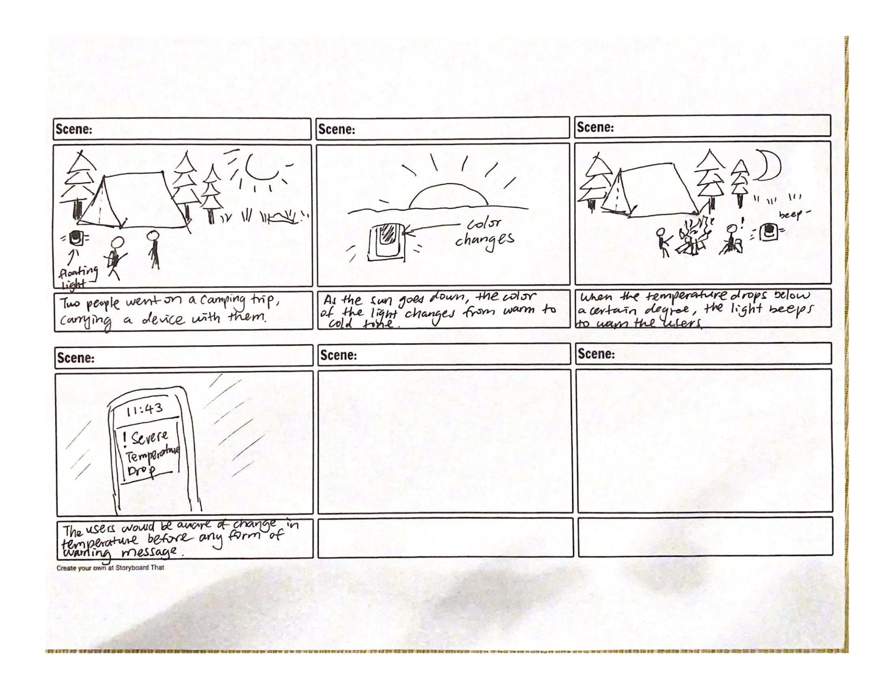
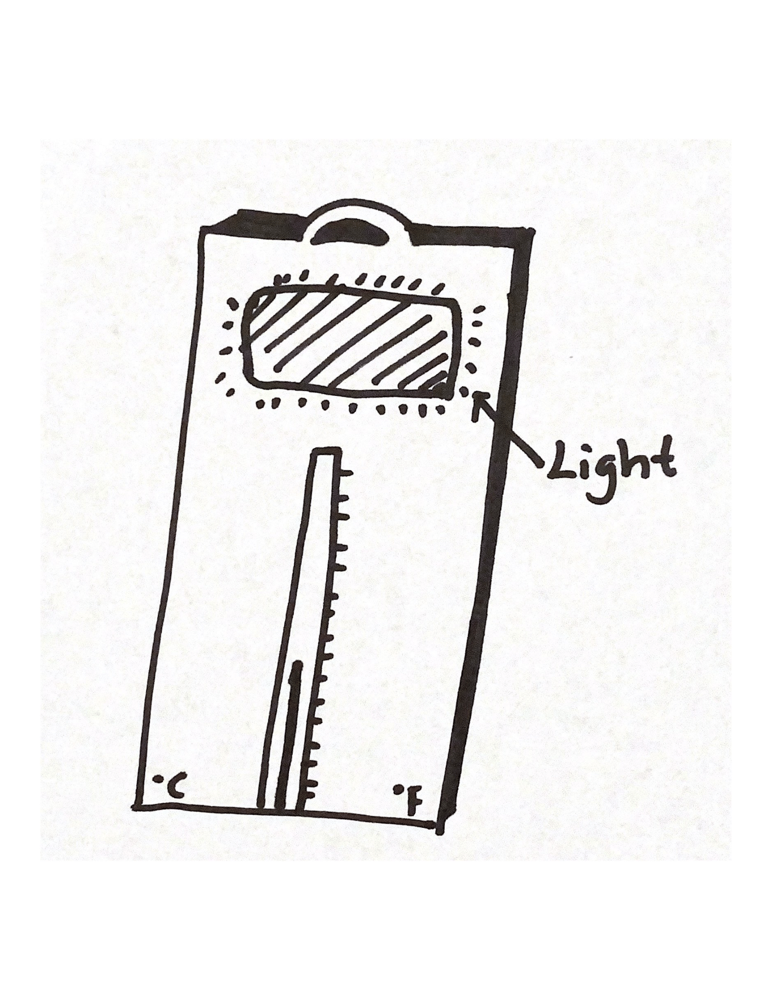

## Prep

1. Set up [your Github "Lab Hub" repository](../../../) by [following these instructions](https://github.com/FAR-Lab/Developing-and-Designing-Interactive-Devices/blob/2021Spring/readings/Submitting%20Labs.md).
2. Set up the README.md for your Hub repository (for instance, so that it has your name and points to your own Lab 1) and [learn how](https://guides.github.com/features/mastering-markdown/) to post links to your submissions on your readme.md so we can find them easily.

### Deliverables for this lab are: 
1. Storyboard
1. Sketches/photos of costumed device
1. Any reflections you have on the process.
1. Video sketch of the prototyped interaction.
1. Submit these in the lab1 folder of your class [Github page], either as links or uploaded files. Each group member should post their own copy of the work to their own Lab Hub, even if some of the work is the same for each person in the group.

## Overview
For this assignment, you are going to 

A) [Plan](#part-a-plan) 

B) [Act out the interaction](#part-b-act-out-the-interaction) 

C) [Prototype the device](#part-c-prototype-the-device)

D) [Wizard the device](#part-d-wizard-the-device) 

E) [Costume the device](#part-e-costume-the-device)

F) [Record the interaction](#part-f-record)

## The Report
Labs are due on Mondays. Make sure this page is linked to on your main class hub page.

## Part A. Plan 
**Describe your setting, players, activity and goals here.**

For this lab, the idea is a outdoor thermometer device that would show a certain color according to the temperature of it's surrounding. The setting would be in both indoor and outdoor environment, ideally with high fluctuation of temperature changes, and the player would be anyone who wants to monitor the change in temperature with immediate notice -- this would be useful for someone who went on hiking, camping, or just lives in an area with such weather. The activity would be that the player gets notified by the changing color on the device, to know the updated status of the surrounding temperature. The goal would be to notify the player as soon as possible if temperature has changed in his or her surrounding environment, this is especially important in the case of a emergency.

**Include a picture of your storyboard here**

**Summarize feedback you got here.**

People reflected on how feasible the interaction would be for this prototype. Also, people agreed that it is an interesting idea that could be useful in critical situations.

## Part B. Act out the Interaction

**Are there things that seemed better on paper than acted out?**

One immediate difference that I noticed is that the change in color of the light might not be obvious. Also, it might be awkward if one needs to consistently look at a light while doing something else. Therefore, it might be important to make sure the message is delivered to the users. 

**Are there new ideas that occur to you or your collaborators that come up from the acting?**

The light could flash if the temperature suddenly dropped or raised by a certain degree (adjustable by the player).

## Part C. Prototype the device

**Give us feedback on Tinkerbelle.**

I am one of those who had a lot of trouble with this tool. I managed to get it working by using a Windows system instead of a Mac. I was pleasantly surprised to find out that Tinkerbelle mainly focuses on color changing. The instruction is clear and easy to use (once it actually works). 

## Part D. Wizard the device

Take a little time to set up the wizarding set-up that allows for someone to remotely control the device while someone acts with it. Hint: You can use Zoom to record videos, and you can pin someone’s video feed if that is the scene which you want to record. 

**Include your first attempts at recording the set-up video here.**

[link to the video](https://drive.google.com/file/d/1IqeaLX3j5p3KZUlPwewfNocZKMMiie10/view?usp=sharing)

Now, hange the goal within the same setting, and update the interaction with the paper prototype. 

**Show the follow-up work here.**

Since the tool has no light flashing ability, a alert sound would be played once the temperature drop below a certain point. 

[link to the updated interaction](https://drive.google.com/file/d/1NnhnhjaSOxh5XXtVswqW73Ac0lsm-AOY/view?usp=sharing)

## Part E. Costume the device

**Include sketches of what your device might look like here.**

**What concerns or opportunitities are influencing the way you've designed the device to look?**

Thermometer would look like -- using the familiar mental image of a thermometer, the look of the device attempts to convey its usage. Since it is a floating device, there is no concern with protection. It is important that the light on the device needs to be big enough to attract attention. 

## Part F. Record

**Take a video of your prototyped interaction.**

[link to the video](https://drive.google.com/file/d/1hu3VkEF5ov88efuwnkTRUnazY4hUlfZi/view?usp=sharing)

**Please indicate anyone you collaborated with on this Lab.**

My mom helped me with some of the filming. I also discussed with Jiadong Lou about the idea in details. 

# Staging Interaction, Part 2 

This describes the second week's work for this lab activity.

## Prep (to be done before Lab on Wednesday)

You will be assigned three partners from another group. Go to their github pages, view their videos, and provide them with reactions, suggestions & feedback: explain to them what you saw happening in their video. Guess the scene and the goals of the character. Ask them about anything that wasn’t clear. 

**Summarize feedback from your partners here.**

## Make it your own

Do last week’s assignment again, but this time: 
1) It doesn’t have to (just) use light, 
2) You can use any modality (e.g., vibration, sound) to prototype the behaviors, 
3) We will be grading with an emphasis on creativity. 

**Document everything here.**
